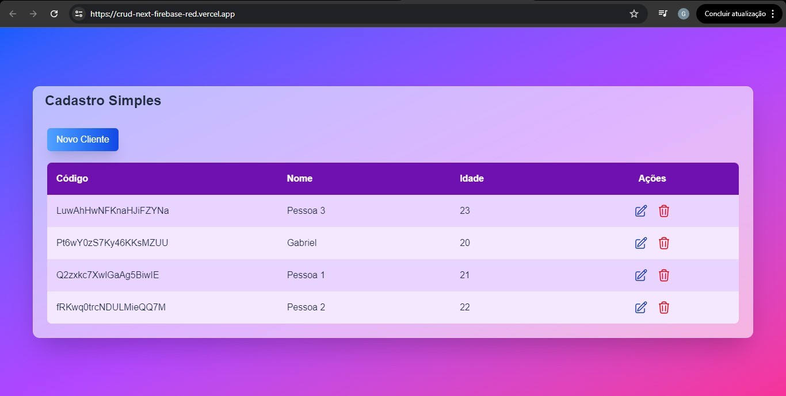
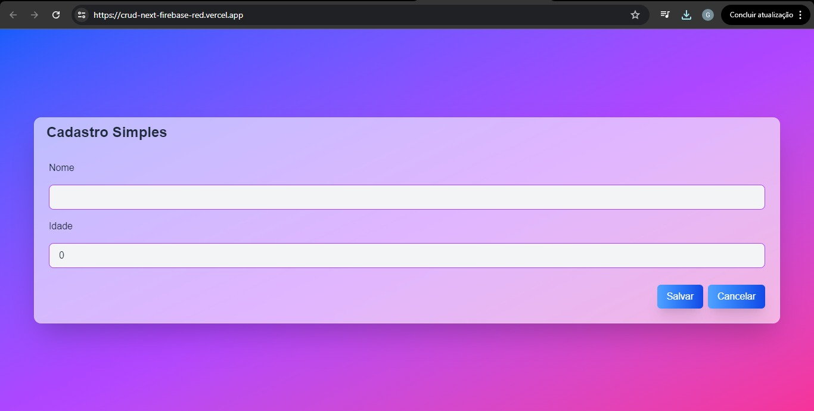

# 🚀 CRUD de Clientes — Next.js + TypeScript + Firebase

Aplicação CRUD moderna desenvolvida com **Next.js**, **TypeScript**, **Tailwind CSS** e **Firebase Firestore**, focada em boas práticas, organização de código e interface responsiva.

Este projeto foi criado para consolidar conhecimentos em desenvolvimento fullstack moderno utilizando tecnologias atuais do mercado.

---

## 🌐 Demonstração

👉 **Acesse online:** https://crud-next-firebase-red.vercel.app/

---

📸 Preview do projeto:




---

## ✨ Funcionalidades

✅ Cadastro de clientes  

✅ Listagem dinâmica integrada ao Firebase  

✅ Edição de registros  

✅ Exclusão de clientes  

✅ Interface responsiva (mobile-first)  

✅ Componentização reutilizável  

✅ Atualização em tempo real via Firestore  

---

## 🛠️ Stack Tecnológica

### Frontend

- Next.js
- React
- TypeScript
- Tailwind CSS

### Backend / Database

- Firebase
- Firestore Database

### Deploy

- Vercel

---

## 📁 Estrutura do Projeto

src/
├── components/ → Componentes reutilizáveis
├── core/ → Modelos e regras de negócio
├── firebase/ → Configuração e integração Firebase
└── pages/ → Rotas da aplicação (Next.js)

---

## 🚀 Rodando localmente

```bash
# Clone o repositório
git clone https://github.com/gabrielcostaw/crud-next-firebase

# Instale as dependências
npm install

# Inicie o projeto
npm run dev

🔐 Variáveis de ambiente

Crie um arquivo .env.local na raiz do projeto:

NEXT_PUBLIC_FIREBASE_API_KEY=
NEXT_PUBLIC_FIREBASE_AUTH_DOMAIN=
NEXT_PUBLIC_FIREBASE_PROJECT_ID=
NEXT_PUBLIC_FIREBASE_APP_ID=

Preencha os valores com as configurações do seu projeto Firebase.

---

🧠 Objetivo do Projeto

Este projeto foi desenvolvido para praticar:

Arquitetura de aplicações React com Next.js

Tipagem forte utilizando TypeScript

Integração com Firebase Firestore

Organização de código com separação de responsabilidades

Construção de interfaces responsivas com Tailwind CSS

---

👨‍💻 Autor

Gabriel Costa

LinkedIn: https://www.linkedin.com/in/gabriel-costa-228ab0382/

GitHub: https://github.com/gabrielcostaw

Email: gcstsantos@gmail.com